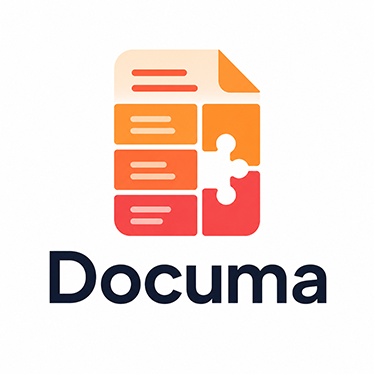

# Documa

<p align="center">
  
</p>

**Documa 是專為 AI agent 設計的文件理解與證據檢索工具，不只是 PDF parser。**

它把 PDF、Word、PowerPoint、HTML、email、notebook、Markdown 與純文字轉成同一套結構化 IR，讓 agent 先看文件結構、按 block 搜尋，再只讀取真正需要的內容。文件處理、索引與搜尋都在本機完成，不呼叫 LLM 或 embedding API；agent 因此能用更少的 context tokens，更快找到可引用的證據。

目前版本：**0.8.0**｜需要 Python **3.10+**

## Overview：Documa 解決什麼問題？

Agent 直接讀長文件，通常會遇到三個問題：

- **整份放進 context 太貴**：文件越長，每次推理需要傳入的 tokens 越多。
- **grep 缺少文件結構**：能找到字串，卻不一定知道它屬於哪一章、哪一頁或哪張表格。
- **一般 chunking 容易破壞語意**：固定長度切塊可能切斷章節、表格與引用關係。

Documa 把文件整理成具有章節、頁碼、bbox 與父子關係的 blocks，並提供一條適合 agent 的漸進式讀取路徑：

```text
文件
  → process / ingest
  → block tree（先看結構）
  → block search（定位候選）
  → bounded read（只讀需要的內容）
  → cite / verify（回到頁碼與 bbox）
```

Agent 不需要先吞下整份文件，而是讓每次工具呼叫只取回「足夠決定下一步」的最小資訊。

## 核心特色

| 能力 | 對 agent 的價值 |
| --- | --- |
| **按 block 搜尋** | 以章節、段落、表格等文件結構為單位定位證據，不只回傳無上下文的命中行。 |
| **內部機制 0 LLM tokens** | process、索引、lexical ranking 與 local feature-hash ANN routing 都不呼叫模型或 embedding API。 |
| **節省主模型 context** | 搜尋先回 compact navigation result，確認候選後才有界讀取原文，避免把整份文件送進 prompt。 |
| **零 LLM 抽取式摘要** | Rust LingXi 直接選取原文子句，保留 block／page 證據與逐句分數；摘要計算本身不送出 prompt。 |
| **單文件理解** | 已知答案在哪份文件時，快速定位、讀取並引用其中的 block。 |
| **多文件理解** | 透過本機 collection index 跨 PDF、Word、Markdown 等文件搜尋、彙總與比較。 |
| **可驗證引用** | block 可回溯到頁碼與 bbox；引用能由程式檢查是否指向真實存在的證據。 |
| **Agent-ready 介面** | 同時提供 MCP、OpenAI function calling、CLI 與 Python API，回傳結構化結果。 |
| **Dynamic Skill Loader** | 對所有明確設定的 skill roots 預編譯 metadata/graph，執行時只 materialize 任務需要且符合 token budget 的原文 blocks。 |

> **「0 token」的精確含義**：Documa 的文件處理與檢索流程本身不會發出 LLM／embedding 請求，因此不消耗模型 API tokens。當 agent 接收搜尋結果、閱讀 block 或生成答案時，仍會使用主模型的 context／output tokens；Documa 的作用是把這部分縮到必要範圍。

## Quick Start：5 分鐘跑通第一個文件

### 前置需求（Prerequisites / Requirements）

- Python 3.10 或更新版本
- 一份要處理的支援格式文件
- 能安裝 Python packages 的本機環境
- 從 source／editable 安裝時需要 Rust 1.88+ 與對應平台的 C/C++ linker；使用預建 wheel 不需要 Rust toolchain

### 1. 安裝

從 repository 安裝目前原始碼：

```powershell
git clone https://github.com/AllanYiin/Documa.git
cd Documa
python -m pip install -e .
```

PDF 0.2.0、Office 0.1.0 與 rust-Lingxi 0.4.5 原始碼都已放在 repository 的 `native/`；安裝會一起編入 Documa。Lingxi 使用私有 `documa._vendor.lingxi` namespace，wheel 與 sdist 皆內附三個經上游核准雜湊驗證的必要模型，不需要公開下載 Lingxi，也不會覆蓋獨立安裝的 `lingxi` 套件。

拿到本次 Windows CPython 3.10 x64 產物時可直接安裝（其他平台需相符的 wheel 或從 sdist 編譯）：

```powershell
python -m pip install .\dist\documa-0.8.0-cp310-cp310-win_amd64.whl
# 已安裝舊版時，先依既有 lifecycle guard 斷開 MCP 再升級：
python -m documa.install --upgrade .\dist\documa-0.8.0-cp310-cp310-win_amd64.whl
```

wheel 自帶 Lingxi，但其他一般 Python 依賴仍由 pip 解析；完全離線安裝須另備依賴 wheelhouse。

若要參與開發，再安裝 dev dependencies：

```powershell
python -m pip install -e ".[dev]"
```

若 0.8.0 已發布到你使用的 package index，也可以直接安裝固定版本（本次僅產出本機封裝）：

```powershell
python -m pip install "documa==0.8.0"
```

先確認執行環境正常：

```powershell
documa doctor
```

### 2. 處理一份文件

以下以 `report.pdf` 為例：

```powershell
documa process .\report.pdf --out .\out\report --export-format block-json
```

成功後，`.\out\report\documa.ir.json` 是後續搜尋、讀取與引用使用的 parser-neutral IR。

Documa 0.8.0 內建 Lingxi 0.4.5，可直接產生不呼叫 LLM 的來源連結摘要：

```powershell
documa summarize .\out\report\documa.ir.json --top-k 8
```

`top_k` 是一般候選的軟上限；Lingxi 0.4.5 將它映射為 ranked block 數量，保留結構與事實時可能回傳更多原文片段。schema v2 的 UTF-8 byte spans 經驗證後轉為既有 Unicode code-point offset，保留 block/source/page 證據。v2 `final_score`／`signal` 分別映射至 `weight`／`explainability`，不與舊版分數直接比較；未評分的保留區塊以零值及 `signals.score_available=false` 明示。預設使用獨立保存的 normalized text；`--text-form raw` 可改選原始文字，兩者不互相覆寫。

### 3. 搜尋相關 blocks

```powershell
documa search-blocks .\out\report\documa.ir.json --query "流動性覆蓋比率" --limit 5
```

搜尋結果會包含排序後的候選 block、結構路徑、頁碼、snippet、預估讀取量，以及可供 agent 繼續呼叫的 `recommended_next.actions[]`。

### 4. 只讀取命中的內容

把搜尋結果中的 block id 帶入：

```powershell
documa block .\out\report\documa.ir.json --id "<搜尋結果的 block id>" --read --max-chars 1500
```

如果內容超過上限，回應會提供 continuation cursor；agent 可以續讀，而不必重新取得整個 block。

### 5. 產生引用

```powershell
documa cite-block .\out\report\documa.ir.json --id "<block id>"
```

典型結果會包含頁面標籤、實體頁碼與 bbox：

```json
{
  "page_label": "PDF p.2",
  "grounding": "visual",
  "bboxes": [
    {"page": 2, "x0": 56.0, "y0": 240.0, "x1": 486.0, "y1": 328.0}
  ],
  "citation_string": "[PDF p.2, bbox(56,240,486,328)]"
}
```

到這裡，你已完成一條完整的 agent evidence path：**搜尋 → 有界讀取 → 可驗證引用**。

想先看文件全貌時，可在搜尋前執行：

```powershell
documa block-tree .\out\report\documa.ir.json --max-depth 2
```

## 為什麼這樣能省 tokens？

Documa 把「找資料」與「讓模型理解答案」分開：

| 階段 | 是否呼叫 LLM／embedding | 傳給主模型的內容 |
| --- | --- | --- |
| 文件解析與 IR 建立 | 否 | 無 |
| block tree、索引與排序 | 否 | 無 |
| block 搜尋 | 否 | 少量候選與 navigation metadata |
| 有界讀取 | 否 | 只有被選中的原文 |
| 最終回答 | 由你的 agent 決定 | 精簡證據與引用 |

搜尋預設使用 compact 的 `nav` response profile，並可透過 `--max-response-tokens` 設定回應上限。結果太多時，Documa 會先裁減低排名項目，而不是讓工具回應無限制膨脹。

### 可重現的 token 實測

在一份 69 頁、全文 49,570 tokens 的 PDF 上，以 10 個事實、數值、定義、中英文關鍵詞問題測試：

| 路徑 | 每題 token 中位數 |
| --- | ---: |
| grep 全部命中行，再讀前 3 個 60 行視窗 | 8,593 |
| Documa 搜尋、照 `recommended_next` 讀取 top hit、產生引用 | **2,035** |
| 整份文件放入 context | 49,570 |

此案例中，Documa 的完整檢索路徑中位數約為 grep 路徑的 **1/4.2**，也約為全文的 **4%**。這是特定文件與查詢集的測量結果，不代表所有文件都會得到相同比例；你可以用自己的文件重跑：

```powershell
python benchmarks\token_economy\compare_grep_vs_documa.py --ir <documa.ir.json> --markdown <documa.md>
```

完整 agent benchmark 入口：

```powershell
python benchmarks\token_economy\run_agent_benchmark.py
```

## Usage：單文件與多文件理解

兩種模式使用相同的 IR、block search、bounded read 與 citation 能力，差別只在搜尋範圍。

### Metadata 提供的篩選訊號

Documa 的 metadata 分成文件、結構、語意、來源定位、內容品質與檢索衍生層。除了 `document_id`、`source_name`、block 階層、`page_refs`／`bbox_refs`，每個文件區塊還可帶有 `keyword_terms`、`new_word_terms`、`search_terms`、confidence、OCR／reading-order trace 與 `content_hash`。搜尋時會再衍生 `doc_region`、answer tags、數字／日期／表格 flags、鄰接 block、去重鍵與建議讀取成本，供 agent 在載入原文前選擇候選證據。

目前公開介面已提供 `document_ids`、`scope_block_id`、`granularity`、`search_body`、`query`／`any_of`、`group_by_document` 與分頁配額等搜尋收斂參數。`block_type`、頁面範圍、`doc_region`、answer tags、confidence、OCR origin、language 與內容類型 flags 已有資料基礎，但目前主要用於排序、診斷或讀取後判斷，尚未成為通用 filter predicates。

完整欄位、排序權重、引用／去重設計與目前能力邊界，請見 [Documa metadata 與後續篩選設計](docs/documa/metadata-and-filtering.md)。

### 單文件：已知答案在哪份文件

適合「這份報告如何定義 X？」或「這份合約的違約金是多少？」：

```powershell
documa process .\contract.pdf --out .\out\contract --export-format block-json
documa search-blocks .\out\contract\documa.ir.json --query "違約金" --limit 5
documa block .\out\contract\documa.ir.json --id "<block id>" --read --max-tokens 500
documa cite-block .\out\contract\documa.ir.json --id "<block id>"
```

### 多文件：先找出答案在哪些文件

多文件模式使用本機 document store 與 SQLite FTS5 collection index。不同格式可以放進同一個 collection：

```powershell
documa ingest .\contracts\master.docx --store-dir .\.documa
documa ingest .\contracts\amendment.pdf --store-dir .\.documa
documa ingest .\contracts\meeting-notes.md --store-dir .\.documa
```

一般 ingest 會增量更新既有索引。第一次建立或需要完整重建時：

```powershell
documa index-collection --store-dir .\.documa
```

先取得「哪些文件提到 X」的文件層級彙總：

```powershell
documa search-collection --store-dir .\.documa --query "違約金" --group-by-document
```

或直接取得跨文件 block 命中，並避免單一文件佔滿結果：

```powershell
documa search-collection --store-dir .\.documa --query "資本要求" --per-document-limit 2
```

Collection 中穩定的讀取鍵是 `(document_id, block_id)`。若已鎖定少數文件，可以重複使用 `--document-id` 收斂範圍。

> Collection search 目前是 lexical／statistical search，不會自動做同義詞、跨語言或語義相似度展開。零結果時，先改用文件原詞、縮寫或較短詞組；需要 semantic retrieval 時，可從預留的 hybrid／vector adapter 邊界接入外部 retriever。

### 不呼叫 LLM 的抽取式摘要

摘要是獨立的 derived view，不會寫回或覆蓋 `DocumentIR` 原文。Python API 同時支援純文字與整份／單一 subtree 文件摘要：

```python
from documa import SummaryOptions, summarize_document, summarize_text

plain = summarize_text("第一句。第二句。", SummaryOptions(top_k=1))
document_summary = summarize_document(document, SummaryOptions(top_k=8), scope_block_id=None)
```

CLI、MCP 與 function calling 使用同一個 `documa_summarize` 契約。回應固定宣告 `extractive: true`、`uses_llm: false`、`llm_tokens_used: 0`；若本機有 tiktoken，也會報告摘要前後的 context token 數與可避免傳入主模型的 tokens。長文件會先按安全字元邊界做本機階層式抽取，再從候選原句中選出全域摘要，不生成新句子。

## Dynamic Skill Loader

Skill loader 使用混合策略：sync 時編譯所有已授權 roots 的 `name`、`description`、triggers、blocks、resources 與權威 dependency edges；task 到來時先選最多三個 skills，再在其中選 blocks、補齊 ancestors／explicit dependencies，最後依真實 tokenizer budget 組成虛擬 `SKILL.md`。它不執行 scripts、不注入 binary assets，也不摘要或改寫來源指令。

```powershell
documa skills root-add managed D:\agent-skills --priority 10
documa skills sync
documa skills load "替這個專案做安全的發布檢查" --max-tokens 3000
documa skills status
```

Managed root 應放在 Codex 原生 skill 掃描路徑之外；原生路徑只保留 plugin 內的精簡 `documa-skill-loader` bootstrap。Python API 可直接使用：

若是明確要接管既有 native skill library，可使用 `--allow-native-scan-overlap` 顯式授權；預設仍拒絕重疊，避免無意間由兩個 loader 重複注入同一 skill。

```python
from documa.skills import load_skill_bundle, sync_skill_roots

sync_skill_roots(store_dir=".documa")
bundle = load_skill_bundle("檢查發布流程")
```

Runtime 完全不呼叫 LLM。若團隊要提高同義詞或觸發條件召回，可在 `sync_skill_roots(..., enrichment_provider=provider)` 接入少量、可快取的離線 enrichment；其輸出只會成為 derived routing metadata，不能建立 instruction 或 dependency truth。

### Shared ContextIR 與 HarnessFold

Documa 可把 DocumentIR、compiled SkillIR 或明確指定的程式碼檔投影成可丟棄的 ContextIR 1.0。ContextIR 的 block 正文與 SHA-256 是取證依據；typed relations 只用於有界導航。來源 digest 不符時 graph 會停用並退回 lexical-only，`INFERRED`／`AMBIGUOUS` 邊預設不展開。

```powershell
documa context-build document out/report/documa.ir.json --out .documa/report.context.json
documa context-build code src/app.py --additional-source src/service.py --out .documa/code.context.json
documa context-build skill my-skill --store-dir .documa --out .documa/skill.context.json
documa context-search .documa/code.context.json "誰呼叫 validate" --intent explore
documa context-read .documa/code.context.json --block-id <block-id> --total-max-bytes 20000
```

這組進階工具也可經 MCP 使用：`documa_build_context`、`documa_context_search`、`documa_context_read_blocks`。它們不加入預設 `agent` profile，以免每次請求支付額外 tool-schema tokens；HarnessFold 透過固定啟動設定引用此契約，負責 folding／lifecycle，而不再複製 Documa 的文件、程式碼與 skill 閱讀權責。

### Repository Intelligence Graph

Documa 的持久化 CodeGraphIndex 會在本機 SQLite sidecar 中記錄 Python workspace、file、module、class、function、method、imports、calls、inheritance、cycles 與 coupling metrics；完整原始碼不寫入 index。每條關係保留 resolver、`EXACT`／`RESOLVED`／`POSSIBLE` resolution、來源位置與檔案 hash，動態呼叫、star import、reflection 等未解析區域則列入 uncertainty receipt。

```powershell
documa code-graph-sync . --store-dir .documa
documa code-graph-query <workspace-id> --intent impact --symbol documa.context.ContextService.search
documa code-graph-read <workspace-id> --block-id <node-id> --expected-generation <generation>
```

```python
from documa.codegraph import query_code_graph, read_code_evidence, sync_code_graph

sync = sync_code_graph(".", store_dir=".documa")
impact = query_code_graph(
    sync["workspace_id"],
    intent="impact",
    symbols=["documa.context.ContextService.search"],
    store_dir=".documa",
)
evidence = read_code_evidence(
    sync["workspace_id"],
    [impact["nodes"][0]["nodeId"]],
    expected_generation=sync["generation"],
    store_dir=".documa",
)
```

MCP 的 `documa_sync_code_graph` 屬 admin profile；`documa_query_code_graph`／`documa_read_code_evidence` 屬 advanced。預設 agent profile 只增加單一 `documa_code_context`，在一次呼叫內回傳 bounded proof path、uncertainty receipt 與最多三個經 hash 驗證的 evidence blocks。ContextIR 1.0 與既有 `context_from_code()` 行為不變。

Release gates 可用 `scripts/evaluate_skill_loader.py` 驗證 explicit-name Top-1、held-out Recall@3、median context reduction 與選配的 agent pass-rate delta；已有 1,000-skill store 時，`scripts/benchmark_skill_loader.py` 會檢查 warm-load p95 是否低於 250 ms。

## 接進你的 agent

### MCP

Documa 內建 MCP server。建議 host 使用 module 方式啟動：

```powershell
python -m documa.interfaces.mcp_server
```

`DOCUMA_MCP_PROFILE=agent` 只暴露完整 evidence workflow 所需的精簡工具面，降低 tool schema 的固定 token 成本。

Repository 內附可直接整合的 host wrappers：

- [Codex plugin](plugins/codex-documa/README.md)
- [Claude Code plugin](plugins/claude-code-documa/README.md)
- [OpenClaw plugin](plugins/openclaw-documa/README.md)
- [Plugin 整合總覽](plugins/README.md)

### OpenAI function calling／Python

```python
from documa.interfaces import call_documa_tool

result = call_documa_tool(
    "documa_search_blocks",
    {
        "ir_path": "out/report/documa.ir.json",
        "query": "資本適足率",
        "limit": 5,
    },
)

hits = result["structuredContent"]["results"]
```

也可以使用 `openai_tool_schemas` 取得 tool schemas，將同一套能力註冊給支援 function calling 的 agent。

### CLI

CLI 適合 shell-based agent、CI 或人工診斷。使用 `documa --help` 查看全部命令，或對個別命令執行：

```powershell
documa search-blocks --help
documa search-collection --help
```

## 支援格式

所有 adapter 都輸出同一套 IR，下游工具不直接依賴 parser 原生物件。

| 類型 | 副檔名 | 重點 |
| --- | --- | --- |
| PDF | `.pdf` | 保留頁面、文字 block 與 bbox；掃描件可選配 OCR。 |
| Word | `.docx` | Rust provider 支援 logical flow、標題、runs、表格、註解/註腳與資產；引用為 structural。 |
| Excel | `.xls`（BIFF8）、`.xlsx` | worksheet、cell address/type/formula/cached value、merged ranges、表格與資產 inventory；引用為 structural。 |
| PowerPoint | `.pptx` | 投影片、placeholder、文字、表格、notes、資產與 points bbox。 |
| HTML | `.html`、`.htm`、`.xhtml` | DOM 順序、標題、段落、表格與連結。 |
| Email | `.eml`、`.msg` | 郵件標頭、本文與附件 metadata；`.msg` 需要 `extract-msg`。 |
| Jupyter Notebook | `.ipynb` | Markdown、程式碼 cell、文字輸出預覽與附件 metadata。 |
| Markdown／text | `.md`、`.markdown`、`.txt` | 標題層級、段落、表格與 fenced code。 |

需要本機 CPU OCR 時：

```powershell
python -m pip install "documa[all]==0.6.4"
documa process .\scan.pdf --ocr --out .\out\scan
```

Office 可使用 `--office-provider auto|rust|python`。預設 `auto` 是 Rust-first；只有 binding 或契約能力缺失時，DOCX/PPTX 才能回退既有 Python adapter。損壞、加密與資源限制錯誤不回退，XLS/XLSX 也沒有 Python fallback。可用下列命令要求嚴格 Rust：

```powershell
documa process .\report.xlsx --office-provider rust --out .\out\report
```

目前不支援舊式 Office `.doc`／`.ppt` 及 macro-enabled OOXML；前者會回傳 `LEGACY_OFFICE_NOT_SUPPORTED`。Email 與 notebook 附件會保存為資產與 metadata，但不會自動遞迴解析成獨立文件。

## PDF 與中文處理

- 中文關鍵詞預設使用內建 **Lingxi 0.4.5**；source checkout 仍相容外部 0.2.1／0.3.0／0.4.5。native binding 無法使用時會明確回退至 n-gram provider。
- `documa summarize` 與 Python `summarize_*` 使用內建 **Lingxi 0.4.5 schema v2**，保留既有 Documa 回應格式與外部 0.3.0 舊版摘要契約。Documa 驗證版本、方法與原文 offset；缺少 provider 時回傳 `SUMMARY_PROVIDER_UNAVAILABLE`，不會以未標示的替代算法偽裝成功。
- PDF extraction 的 `auto` 模式會在可用時選擇 Rust provider，否則回退至 PyMuPDF。
- Rust PDF provider 仍在擴大版面品質驗證範圍。對表格、caption、footnote 或複雜版面特別敏感時，建議明確使用 `--pdf-provider pymupdf` 比較結果。
- OCR 產物會標記 `origin: "ocr"` 與 confidence，不會冒充原生文字。

## 什麼時候不適合用 Documa？

- 文件只有幾頁、只問一次，而且直接放進 context 更簡單。
- 需求核心是同義改寫、跨語言概念對齊或純 semantic similarity；Documa 目前不內建 embeddings。
- 需求是判斷印章、簽名、圖片等視覺內容，而不是文字與文件結構。
- 你需要完整的文件管理 UI；Documa 第一階段定位是 LLM-ready document understanding package。
- 你只需要底層 PDF 文字抽取，而且既有 parser 已滿足需求。

## 升級

首次安裝可直接使用 pip。已安裝 Documa 且 MCP server 可能仍在執行時，請使用受控升級入口：

```powershell
python -m documa.install --upgrade "documa==0.6.4"
```

它會先協調既有 Documa MCP process 退出，再執行安裝，避免 Windows 上的 executable file lock。不要在 MCP server 仍連線時直接覆寫安裝。

## 開發與驗證

```powershell
python -m pip install -e ".[dev]"
python -m pytest
documa doctor
documa benchmark --mode quality
```

新增 parser adapter 時，在 `src/documa/adapters/` 實作並於 `registry.py` 註冊副檔名。Adapter 只應回傳 IR，不應讓 core 依賴 parser 原生物件。

新增 public tool 時，請同步檢查 `interfaces/tools.py`、`tool_schemas.py`、`mcp_server.py`、`cli.py` 與對應測試，確保 CLI、MCP 與 function calling 的結構化契約一致。

## 深入閱讀

| 主題 | 文件 |
| --- | --- |
| 架構分層與設計 | [docs/documa/architecture.md](docs/documa/architecture.md) |
| Metadata 與後續篩選 | [docs/documa/metadata-and-filtering.md](docs/documa/metadata-and-filtering.md) |
| IR 相容性契約 | [docs/spec/ir-compatibility.md](docs/spec/ir-compatibility.md) |
| PDF gold fixtures 與品質門檻 | [fixtures/pdf/gold/README.md](fixtures/pdf/gold/README.md) |
| Token economy benchmark | [benchmarks/token_economy/](benchmarks/token_economy/run_agent_benchmark.py) |
| Agent plugins | [plugins/README.md](plugins/README.md) |
| Answer verification example | [examples/answer_verification/README.md](examples/answer_verification/README.md) |

## License

MIT.
