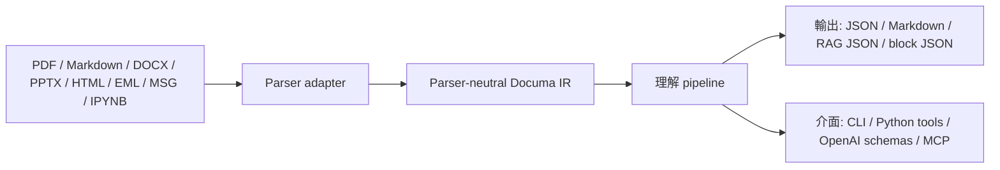

# Documa

## 概覽

Documa 是一個以 Python 套件為核心、面向 LLM 的文件理解套件。它的目標不是取代底層 PDF parser，而是把 parser 產出的低階訊號整理成穩定、可追溯、可被 agent、RAG、MCP 與 tool-calling 工作流使用的文件中介表示。

目前定位是 Beta 階段的開發者套件：

- 核心是 Python package，不在核心 repo 內建產品 UI。
- 文件 parsing 透過 adapter 接入，目前包含 `PyMuPDFAdapter`、`MarkdownAdapter`、`DocxAdapter`、`PptxAdapter`、`HtmlAdapter`、`EmailAdapter` 與 `IpynbAdapter`；core 不直接依賴 parser-native object。
- 內部文字使用 Python Unicode `str`；JSON 與檔案輸出預設 UTF-8，JSON 使用 `ensure_ascii=False`。
- 保留原始文字與正規化文字，不靜默覆蓋原文。
- CLI、Python tool layer、OpenAI tool schema 與 MCP wrapper 共用同一組結構化結果契約。

## 為什麼需要 Documa

一般 PDF parser 多半負責「從 PDF 拿到文字、座標、圖片或表格候選」。這很重要，但對 LLM 應用通常還不夠：PDF 的自然閱讀順序、段落、頁首頁尾、表格脈絡、註腳、圖片 caption、RAG chunk provenance，以及 agent 需要的漸進式讀取介面，都需要額外的整理層。

Documa 補的是這一層。



## 與一般 PDF parser 的差異

| 面向 | 一般 PDF parser | Documa |
| --- | --- | --- |
| 邊界 | 直接暴露 parser API 或 parser-specific result | 透過 adapter 轉成 parser-neutral `DocumentIR` |
| 文字處理 | 常只輸出 parser text | 同時保留 `raw_text` 與 `normalized_text` |
| 版面理解 | 提供座標、block、span 等低階訊號 | 在 pipeline 裡建立 reading order、paragraph、layout class、table/image normalization |
| 可追溯性 | 下游自行追頁碼與座標 | IR 保存 page refs、bbox refs、source refs、relations、metadata |
| LLM ingestion | 通常輸出純文字或簡單 chunk | 產生 RAG chunk、block tree、keyword metadata、provenance |
| Agent 讀取 | 常需要一次餵完整文件 | 提供 `list/search/read block` 的 progressive reading tools |
| 整合方式 | 綁定特定 library | 同一能力可透過 CLI、Python tool layer、OpenAI function schema、MCP wrapper 使用 |
| 品質門檻 | 多靠手動測試 | 內建 `doctor`、fixture benchmark 與 regression tests |

Documa 對 PDF parser 的態度是「adapter-based composition」：底層 parser 專注 extraction，Documa 專注把 extraction result 變成穩定、可維護、可供 LLM 使用的文件理解資料層。

## 核心概念

- `DocumentIR`：Documa 的 parser-neutral source of truth，定義在 `src/documa/core/ir.py`。
- Adapter：把外部格式轉成 `DocumentIR`，例如 `PyMuPDFAdapter`、`MarkdownAdapter`、`DocxAdapter`、`PptxAdapter`、`HtmlAdapter`、`EmailAdapter` 與 `IpynbAdapter`。
- Pipeline stage：對 IR 做保守、可測試的轉換，例如 reading order、inline semantics、paragraph grouping、table normalization、relations、block tree、chunking。
- Relation：用來表達 footnote、TOC、caption、provenance 等可追溯連結；不確定時保留 unresolved evidence，而不是假裝成功。
- Document block：面向 agent 的 progressive disclosure tree。agent 可以先看 metadata，再只讀相關 section、paragraph、table 或 image block。
- Exporter / viewer：把 IR 輸出成 `json`、`markdown`、`rag-json`、`block-json`，或產生 universal human viewer。
- Tool layer：`documa_parse`、`documa_process`、`documa_search_blocks` 等工具共用同一組 structured result。

## 快速開始

以下命令以 PowerShell 為例。若在 macOS/Linux，虛擬環境啟動指令可改成 `source .venv/bin/activate`。

### 前置條件（Prerequisites / Requirements）

- Python 3.10 或更新版本。
- 這個 repo 的 checkout，或已安裝的 `documa` package。
- 若要處理 PDF、DOCX、PPTX、HTML、MSG 或 IPYNB，需安裝對應 extra；Markdown 與 EML adapter 不需要額外依賴。
- 若要使用 MCP 或 demo 整合，需視情況安裝 `mcp` 與 `demo` extras。

### 1. 從 package index 安裝

發布到 PyPI 或相容的 private index 後，可直接安裝 runtime package：

```powershell
python -m pip install "documa[documents]"
```

若只需要 Markdown adapter、IR、pipeline、exporters 與 tool schema，可省略格式 extras：

```powershell
python -m pip install documa
```

### 2. 從 Git repo 安裝

尚未發布到 package index，或要安裝特定 Git revision 時，可透過 pip 的 direct URL 安裝：

```powershell
python -m pip install "documa[documents] @ git+https://github.com/AllanYiin/Documa.git"
```

### 3. 從本地 wheel 安裝

在 repo checkout 內先建立 distribution artifacts：

```powershell
python -m pip install --upgrade build
python -m build
```

接著安裝產出的 wheel：

```powershell
python -m pip install ".\dist\documa-0.1.0-py3-none-any.whl[documents]"
```

### 4. 從 repo checkout 做開發安裝

```powershell
git clone https://github.com/AllanYiin/Documa.git
cd Documa

python -m venv .venv
.\.venv\Scripts\Activate.ps1
python -m pip install --upgrade pip
python -m pip install -e ".[dev,documents]"
```

若要一次安裝完整整合面：

```powershell
python -m pip install -e ".[dev,documents,mcp,demo]"
```

可選 extras：

| Extra | 用途 |
| --- | --- |
| `pdf` | 安裝 PyMuPDF，讓 `PyMuPDFAdapter` 可處理 PDF。 |
| `docx` | 安裝 python-docx，讓 `DocxAdapter` 可處理 DOCX。 |
| `pptx` | 安裝 python-pptx，讓 `PptxAdapter` 可處理 PPTX。 |
| `html` | 安裝 beautifulsoup4，讓 `HtmlAdapter` 可處理 HTML。 |
| `msg` | 安裝 extract-msg，讓 `EmailAdapter` 可處理 Outlook MSG。 |
| `ipynb` | 安裝 nbformat，讓 `IpynbAdapter` 可處理 Jupyter Notebook。 |
| `documents` | 一次安裝 PDF、DOCX、PPTX、HTML、MSG 與 IPYNB adapter 依賴；EML 使用 Python 標準庫。 |
| `mcp` | 安裝 `documa-mcp` 需要的 MCP 依賴。 |
| `demo` | 安裝 demo 需要的選用依賴，例如 token counting 與 OpenAI SDK support。 |
| `dev` | 安裝測試依賴。 |

### 5. 驗證環境

```powershell
documa doctor
```

預期結果：回傳結構化 JSON 診斷。缺少選用整合時會以 warning 呈現，與 core package failure 分開。

如果 console script 還不能使用，可改用 module 入口：

```powershell
$env:PYTHONPATH="src"
python -m documa.cli doctor
```

### 6. 處理文件

```powershell
documa process "<path-to-report.pdf|.md|.docx|.pptx|.html|.eml|.msg|.ipynb>" `
  --out ".\out\report" `
  --lang zh-Hant,en `
  --export-format block-json
```

預期輸出：

- `.\out\report\documa.ir.json`：完整 Documa IR。
- `.\out\report\documa.rag.json`：帶有來源 metadata 的 retrieval chunks。
- `.\out\report\documa.blocks.json`：漸進式讀取用的 block tree。
- `.\out\report\assets\...`：可用時輸出 page preview、文件圖片、email attachments 或 notebook attachments。

`process` 是高階 ingestion 指令，會執行 parse 加上預設理解 pipeline。若只需要 adapter boundary，可使用 `parse`：

```powershell
documa parse "<path-to-report.pdf|.md|.docx|.pptx|.html|.eml|.msg|.ipynb>" --out ".\out\parsed" --lang zh-Hant,en
```

### 7. 像 agent 一樣讀文件

完成 `process` 後，可以先檢查與搜尋 logical blocks，再只讀相關內容：

```powershell
documa blocks ".\out\report\documa.ir.json"
documa search-blocks ".\out\report\documa.ir.json" --query "主要風險"
documa block ".\out\report\documa.ir.json" --id "<block-id>"
documa block ".\out\report\documa.ir.json" --id "<block-id>" --read
```

這是主要的 LLM-facing 使用模式：先 list 或 search metadata，再載入選定 block body 與 provenance。

### 8. 產生 Universal Viewer

若要把任一 Documa 支援格式呈現成階層式 human viewer，可使用 `view`：

```powershell
documa view "<path-to-report.pdf|.md|.docx|.pptx|.html|.eml|.msg|.ipynb>" `
  --format html `
  --out ".\out\report\viewer.html" `
  --query "主要風險" `
  --include-body
```

也可以從既有 IR 產生 viewer：

```powershell
documa view ".\out\report\documa.ir.json" --from-ir --format markdown --query "主要風險"
```

Universal viewer 會輸出：

- 文件層 metadata：parser、頁數、block/chunk/relation/table/image counts 與 adapter metadata。
- 階層式 document blocks：document / section / page / paragraph / table / image 等 progressive blocks。
- 每個 block 的 metadata、page refs、citation label、preview，以及可選的 bounded body。
- query results：用同一份 block hierarchy 對 title、preview、body 與 metadata 做 deterministic lexical query。

同一能力也暴露為 `documa_view` tool，可由 direct tool-calling、OpenAI tool schema 與 MCP 使用；若需要更細的查詢流程，仍可搭配 `documa_list_blocks`、`documa_search_blocks`、`documa_read_block` 與 `documa_block_xref`。

### 9. 輸出給下游系統

```powershell
documa export ".\out\report\documa.ir.json" --format markdown --out ".\out\report\documa.md"
documa export ".\out\report\documa.ir.json" --format rag-json --out ".\out\report\documa.rag.json"
documa export ".\out\report\documa.ir.json" --format block-json --out ".\out\report\documa.blocks.json"
```

支援格式：

- `json`：完整 Documa IR。
- `markdown`：帶 page markers 的可讀 Markdown。
- `rag-json`：供 retrieval ingestion 使用的 chunk records。
- `block-json`：供 progressive reading workflow 使用的 document block tree。

### 10. 使用 tool schemas 或 MCP

列出 Documa tools：

```powershell
documa tools
```

在 Python 中取得 OpenAI-compatible function tool descriptors：

```python
from documa.interfaces import openai_tool_schemas

tools = openai_tool_schemas(strict=True)
```

直接呼叫共用 tool layer：

```python
from documa.interfaces import call_documa_tool

result = call_documa_tool(
    "documa_view",
    {
        "source": "report.pdf",
        "format": "json",
        "query": "主要風險",
        "include_body": False,
    },
)
```

啟動選用 MCP server：

```powershell
python -m pip install -e ".[mcp]"
documa-mcp
```

### 11. 執行測試

```powershell
python -m pytest
```

若沒有安裝 pytest，也可使用 unittest：

```powershell
python -m unittest discover -s tests
```

## 使用方式

- CLI ingestion：使用 `documa process` 走預設 parser-plus-pipeline 路徑。
- Python library usage：把 Documa 嵌入其他 package 時，可直接呼叫 adapters 與 pipeline stages。
- Tool-calling usage：由 agent runtime 負責執行工具時，使用 `call_documa_tool()` 或 `openai_tool_schemas()`。
- MCP usage：需要讓 MCP host discover Documa tools 時，執行 `documa-mcp`。
- Example usage：要建立下游 app 時，可從 `examples/pdf_chat_like/` 或 `examples/pdf_chat_like_web/` 開始。

## 專案結構

| 路徑 | 用途 |
| --- | --- |
| `src/documa/core/` | IR models、serialization、encoding、language 與 text normalization utilities。 |
| `src/documa/adapters/` | Parser adapters。外部 parser objects 不應跨出此邊界。 |
| `src/documa/pipeline/` | Parser-neutral understanding stages 與 default pipeline orchestration。 |
| `src/documa/exporters/` | JSON、Markdown、RAG JSON 與 block JSON exporters。 |
| `src/documa/interfaces/` | Shared tool functions、JSON schemas、OpenAI schema wrapper 與 MCP server wrapper。 |
| `src/documa/quality/` | Doctor checks 與 fixture benchmark support。 |
| `examples/` | 使用 public package surface 建立的可執行 integration examples。這些是 examples，不是核心 UI。 |
| `fixtures/pdf/` | PDF parsing risk coverage 的 fixture manifest。 |
| `docs/documa/` | Architecture notes 與 expert review log。 |
| `tests/` | IR、pipeline、adapters、CLI 與 tool interfaces 的 unit / regression tests。 |

## 以開發者方式使用 Documa

### 使用 Python API

```python
from documa.adapters.base import ParseOptions
from documa.adapters.pymupdf_adapter import PyMuPDFAdapter
from documa.pipeline.runner import run_default_pipeline

document = PyMuPDFAdapter().parse(
    "report.pdf",
    ParseOptions(languages=["zh-Hant", "en"]),
)
pipeline_run = run_default_pipeline(document)
processed_document = pipeline_run.document
```

### 新增 parser adapter

新增 parser integration 時：

1. 實作 `ParserAdapter`。
2. Adapter 只回傳 Documa IR objects。
3. Parser-native objects 必須留在 adapter boundary 內。
4. 原始文字與正規化文字要分開保留。
5. 補上 repair loops 需要的 page refs、bbox refs、source refs 與 metadata。
6. 為 adapter 與它啟用的新 pipeline behavior 加測試。

### 新增 public tool 或物件

新增公開能力時，需同步考慮完整 lifecycle：

- create/update/delete/state behavior，若該能力適用；
- CLI surface；
- Python tool function；
- MCP wrapper；
- tool-calling schema；
- structured success 與 error payloads；
- regression tests。

## 範例

`examples/pdf_chat_like/` 示範 CLI-first 的 PDF progressive reading workflow：

```powershell
$env:PYTHONPATH="src"
python examples\pdf_chat_like\pdf_chat_example.py "<path-to-report.pdf>" `
  --question "這份文件的主要風險是什麼？" `
  --out ".\out\documa-pdf-chat"
```

`examples/pdf_chat_like_web/` 示範 local browser UI 如何呼叫 Documa，同時讓 Documa core 維持 UI-free：

```powershell
$env:PYTHONPATH="src"
python examples\pdf_chat_like_web\server.py --port 8765
```

接著開啟 `http://127.0.0.1:8765`。

## 品質門檻

發布或改動 public behavior 前，建議先跑：

```powershell
documa doctor
documa benchmark
python -m pytest
```

GitHub PR 會透過 `.github/workflows/ci.yml` 在 Python 3.10、3.11、3.12 上安裝 `.[dev,documents]`，並執行 `python -m pytest` 與 `documa doctor` 作為確認前的自動測試 gate。

如果 release gate 要求每個宣告的 fixture PDF 都必須存在，使用 `--require-files`：

```powershell
documa benchmark --require-files --out ".\out\documa-benchmark.json"
```

## 已知限制

- Documa core 不是 UI product。UI code 應留在 examples 或 downstream applications。
- Documa 不從零實作底層 parser。PDF、DOCX、PPTX、HTML、MSG 與 IPYNB extraction 透過 adapters 委派給專門 library；EML 使用 Python 標準庫 MIME parser。
- 目前 pipeline stages 是保守 baseline，不是完美的 document understanding model。
- OCR-only 或 image-only PDFs 需要 core 假設以外的 parser/OCR 支援。
- DOCX 與 HTML 目前使用 logical flow / DOM order；PPTX 使用 slide order；EML/MSG 使用 logical email page；IPYNB 使用 cell order，皆映射成 logical page。
- 選用 LLM usage 只出現在 demos 或 downstream integrations。Core parsing 與 processing 是 deterministic，可離線執行。

## 疑難排解

| 症狀 | 可能原因 | 修正方式 |
| --- | --- | --- |
| `PyMuPDF is required for PyMuPDFAdapter.` | 尚未安裝 `pdf` extra。 | 在 repo checkout 內執行 `python -m pip install -e ".[pdf]"`。 |
| `python-docx is required for DocxAdapter.` | 尚未安裝 `docx` extra。 | 執行 `python -m pip install -e ".[docx]"` 或 `python -m pip install -e ".[documents]"`。 |
| `python-pptx is required for PptxAdapter.` | 尚未安裝 `pptx` extra。 | 執行 `python -m pip install -e ".[pptx]"` 或 `python -m pip install -e ".[documents]"`。 |
| `beautifulsoup4 is required for HtmlAdapter.` | 尚未安裝 `html` extra。 | 執行 `python -m pip install -e ".[html]"` 或 `python -m pip install -e ".[documents]"`。 |
| `extract-msg is required for Outlook MSG parsing.` | 尚未安裝 `msg` extra。 | 執行 `python -m pip install -e ".[msg]"` 或 `python -m pip install -e ".[documents]"`。 |
| `nbformat is required for IpynbAdapter.` | 尚未安裝 `ipynb` extra。 | 執行 `python -m pip install -e ".[ipynb]"` 或 `python -m pip install -e ".[documents]"`。 |
| 找不到 `documa` 指令。 | Virtual environment 未啟用，或 package 尚未 editable install。 | 啟用 `.venv`，重新執行 `python -m pip install -e ".[dev,documents]"`，或改跑 `$env:PYTHONPATH="src"; python -m documa.cli ...`。 |
| `documa-mcp` 無法 import MCP modules。 | 尚未安裝 `mcp` extra。 | 執行 `python -m pip install -e ".[mcp]"`。 |
| PDF 結果的 reading order 不如預期。 | PDF text order 受來源 PDF 的產生方式影響。 | 檢查 `documa.ir.json`，使用 block search/read tools，並在改 pipeline heuristics 前補 fixture coverage。 |

## 上游背景

以下上游概念是 Documa 邊界設計的依據：

- PyMuPDF 文件說明，plain PDF text extraction 不一定保留 natural reading order，而 block/word extraction 會帶有可用於 layout repair 的 position information：[PyMuPDF text recipes](https://pymupdf.readthedocs.io/en/latest/recipes-text.html)。
- Python `email.parser` 提供 MIME message parser，可從 serialized email bytes 建立 `EmailMessage` 並遍歷 multipart body 與 attachments：[Python email.parser](https://docs.python.org/3/library/email.parser.html)。
- `extract-msg` 提供 Outlook `.msg` 解析入口，Documa 只在 adapter boundary 內使用該 parser：[extract-msg documentation](https://msg-extractor.readthedocs.io/en/latest/extract_msg/index.html)。
- `nbformat` 是 Jupyter notebook 官方格式 API，可讀取 `.ipynb` 並轉成 versioned notebook node：[nbformat API](https://nbformat.readthedocs.io/en/latest/api.html)。
- OpenAI function calling 使用 JSON-schema-defined tools，並由 application side 執行 tool call：[OpenAI function calling guide](https://developers.openai.com/api/docs/guides/function-calling)。
- MCP tools 回傳 content 與 structured results，並支援 structured output schemas：[MCP tools specification](https://modelcontextprotocol.io/specification/2025-06-18/server/tools)。

如果你要改 Documa 的 integration layer，請先重新核對目前的 upstream docs，再變更 schemas 或 protocol behavior。
