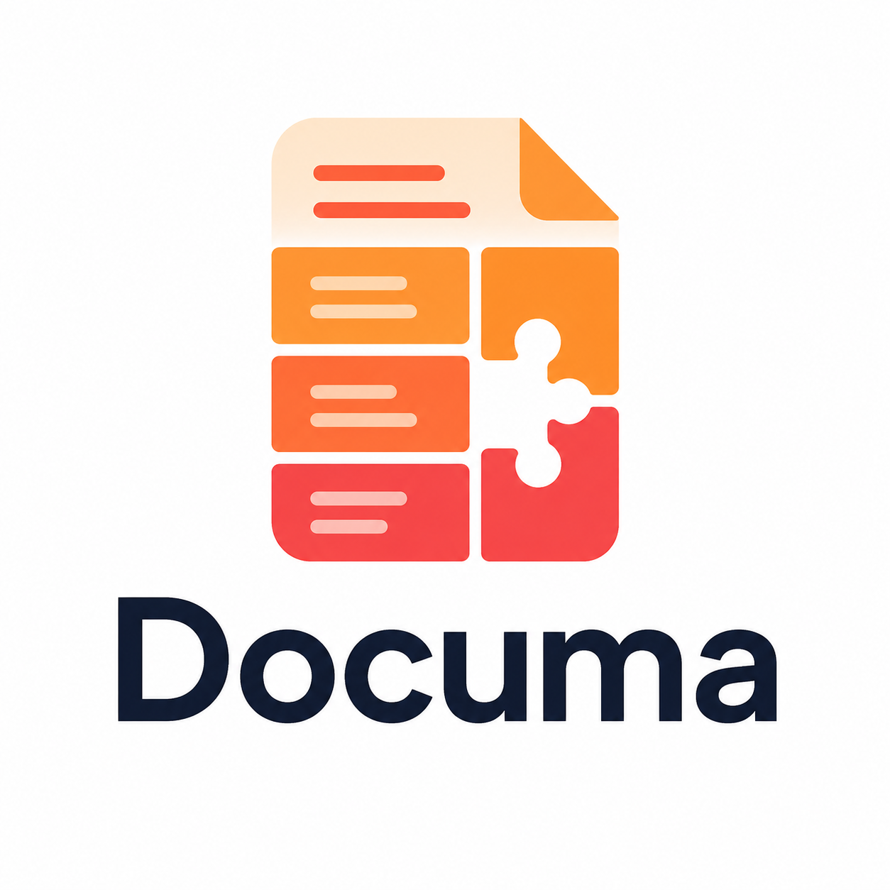

# Codex Documa Plugin

<p align="center">
  
</p>

這個 plugin 透過 bundled MCP server config 與 reusable evidence workflow skill，把 Documa 暴露給 Codex。它不打包 Documa 本體；請先在 Codex 可見的 Python 環境安裝 Documa。

```powershell
python -m pip install -e ".[documents,mcp]"
```

使用 Codex local plugin flow 載入 `plugins/codex-documa`。啟用後，在 Codex 內用以下指令確認 MCP server：

```text
/mcp
```

建議先把 plugin-scoped MCP server 設成 prompt approval，再視團隊需求縮小可用 tools。例如：

```toml
[plugins."codex-documa".mcp_servers.documa]
enabled = true
default_tools_approval_mode = "prompt"
enabled_tools = [
  # single-document reading loop
  "documa_process",
  "documa_search_blocks",
  "documa_list_blocks",
  "documa_block_tree",
  "documa_block_xref",
  "documa_inspect_block",
  "documa_read_block",
  # multi-document collection loop
  "documa_ingest",
  "documa_list_documents",
  "documa_index_collection",
  "documa_search_collection",
  # evidence close-out
  "documa_cite_block",
  "documa_render_citation",
  "documa_source_window",
  "documa_verify_citations",
  "documa_doctor"
]
```

Expected workflow / 預期流程：

1. Single document: `documa_process` → `documa_search_blocks`/`documa_list_blocks`/`documa_block_tree` → `documa_read_block` for only the selected block bodies.
2. Multiple documents: `documa_ingest` per file (the collection index updates incrementally) → breadth via `documa_search_collection --group-by-document` → narrow with `document_ids` + `per_document_limit` → chain `read_ref` into `documa_read_block`.
3. Follow each search response's `recommended_next` and `hints`; bound output with `max_chars`/`max_tokens`/`max_response_tokens`.
4. Close out with `documa_cite_block`/`documa_verify_citations`, citing block ids, page/source metadata, and evidence boundaries.

本地驗證：

```powershell
python scripts\validate_agent_plugins.py
```
